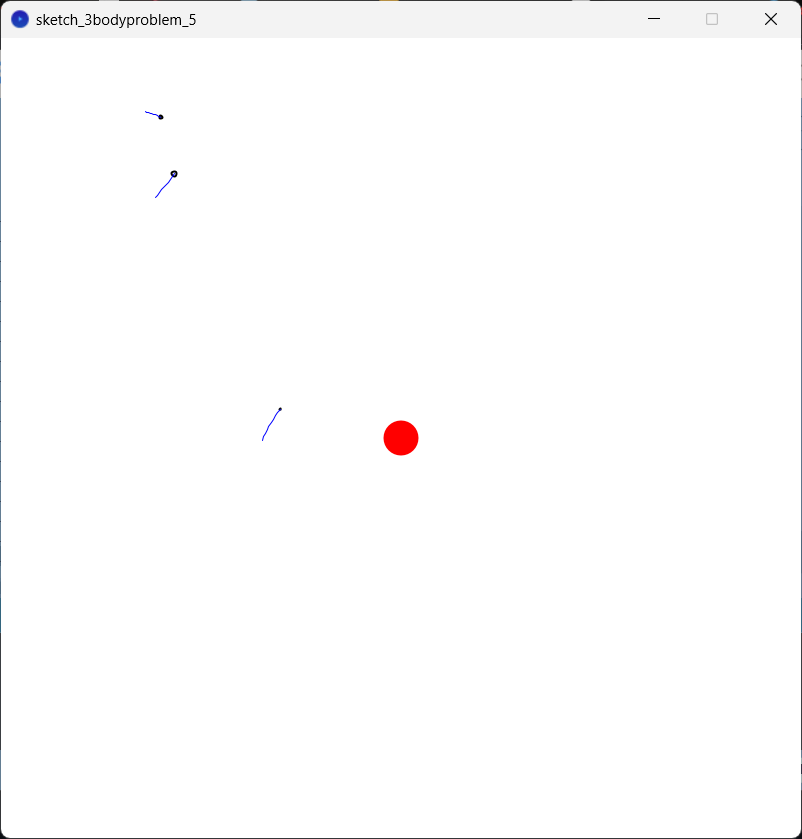

# 3BodyProblem

A simple example of a 3 body problem with a star in the middle, which is not moving, and three planets.  (I know that it's not exactly a "3" body problem, but the idea was that and in this way it's more visually presentable in my opinion)

 
